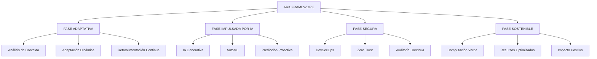

# ARK DEV

<div align="center">
  <a href="https://www.ark-dev.org/" target="_blank" rel="noopener noreferrer">
    
  </a>
  
  <h3>Consultoría Privada de Tecnología Enterprise | Desarrollo de Software | Ciberseguridad | IA</h3>
  
  <p>
    <a href="https://www.ark-dev.org/" target="_blank" rel="noopener noreferrer">
      
    </a>
    <a href="https://www.ark-dev.org/" target="_blank" rel="noopener noreferrer">
      
    </a>
    <a href="#licencia">
      
    </a>
    <a href="https://www.ark-dev.org/nosotros.html" target="_blank" rel="noopener noreferrer">
      
    </a>
  </p>
</div>

---

## Índice de Contenidos

- [Acerca de ARK DEV](#acerca-de-ark-dev)
- [Nuestra Misión y Visión](#nuestra-misión-y-visión)
- [Unidades de Negocio](#unidades-de-negocio)
  - [ARK DEV SYSTEM](#ark-dev-system)
  - [ARK DEV SOLUTIONS](#ark-dev-solutions)
  - [ARK SECURE](#ark-secure)
  - [ARK BIO](#ark-bio)
- [Metodología ARK Framework](#metodología-ark-framework)
- [Stack Tecnológico](#stack-tecnológico)
- [Liderazgo](#liderazgo)
- [Casos de Éxito](#casos-de-éxito)
- [Certificaciones y Estándares](#certificaciones-y-estándares)
- [Contacto](#contacto)
- [Licencia](#licencia)

---

## Acerca de ARK DEV

**[ARK DEV](https://www.ark-dev.org/)** es una **consultora privada tecnológica de vanguardia** especializada en soluciones innovadoras para transformación digital integral de empresas en Latinoamérica y el mundo. 

Fundada en **abril de 2024** en **Santiago, Chile**, y con operaciones establecidas en **La Paz, Bolivia** desde 2025, ARK DEV representa el renacimiento desde la oscuridad tecnológica hacia la luz de la innovación digital. Fundada por **Joel Andrés**, un visionario tecnológico comprometido con la excelencia y la innovación continua, nuestro ecosistema integrado de submarcas especializadas cubre todas las necesidades tecnológicas empresariales.

### Información de la Empresa

| Categoría | Detalles |
|-----------|----------|
| **Fundación** | Abril 2024 |
| **Sede Principal** | Santiago, Chile |
| **Operaciones** | La Paz, Bolivia (2025) |
| **Tipo de Empresa** | Consultoría Privada Tecnológica |
| **Industria** | Tecnología de la Información, Desarrollo de Software, Ciberseguridad |
| **Especializaciones** | Desarrollo de Software, IA, Ciberseguridad Enterprise, Hardware IoT, Biotecnología |
| **Sitio Web** | [www.ark-dev.org](https://www.ark-dev.org/) |
| **Experiencia** | Más de 1 año construyendo el futuro tecnológico |
| **Proyectos Entregados** | 57+ proyectos exitosos |
| **Clientes Globales** | 37+ clientes satisfechos |

### Competencias Principales

- **Desarrollo de Software Enterprise** - Aplicaciones empresariales personalizadas con tecnologías modernas (.NET, Python, C++)
- **Inteligencia Artificial y Machine Learning** - IA Generativa, AutoML, análisis predictivo
- **Ciberseguridad Enterprise** - Penetration testing, auditorías de seguridad, SOC/SIEM
- **Hardware e IoT Avanzado** - Soluciones IoT industriales, sistemas embebidos, Arduino/Raspberry Pi
- **Investigación en Biotecnología** - Bioingeniería digital e IA aplicada a salud (Próximamente 2025)

---

## Nuestra Misión y Visión

### Misión

> "Proveer soluciones tecnológicas innovadoras y personalizadas que impulsen la transformación digital garantizando calidad superior, seguridad inquebrantable y eficiencia operacional máxima para cada cliente que confía en nosotros. Nos comprometemos a entregar resultados medibles y valor sostenible en cada proyecto."

### Visión

> "Ser la consultora tecnológica líder en Latinoamérica, reconocida por excelencia absoluta en desarrollo software, ciberseguridad enterprise e inteligencia artificial con impacto global y transformación positiva. Aspiramos a convertirnos en el socio tecnológico preferido de empresas innovadoras que buscan resultados excepcionales."

### Valores Fundamentales

- **Innovación continua** como motor de crecimiento y diferenciación competitiva
- **Compromiso inquebrantable** con calidad premium en cada entrega y proyecto
- **Transparencia absoluta** en cada proyecto, comunicación y relación comercial
- **Enfoque en resultados medibles** que generen valor real, tangible y sostenible

---

## Unidades de Negocio

ARK DEV opera a través de cuatro divisiones especializadas, cada una enfocada en entregar excelencia en sus respectivos dominios tecnológicos.

### ARK DEV SYSTEM

**[ARK DEV SYSTEM](https://www.ark-dev.org/ark_dev_system.html)** - Desarrollo de Software Inteligente con Integración de IA

División enfocada en desarrollo de software inteligente con integración de IA avanzada, automatización industrial y sistemas personalizados a medida para empresas innovadoras que buscan ventajas competitivas tecnológicas.

**Servicios principales:**
- Aplicaciones web y móviles nativas multiplataforma
- Sistemas ERP y CRM personalizados a medida
- Integración de APIs y arquitecturas microservicios
- Arquitecturas cloud escalables y resilientes
- Automatización de procesos empresariales con IA
- Soporte técnico y mantenimiento continuo 24/7

**Más información:** [www.ark-dev.org/ark_dev_system.html](https://www.ark-dev.org/ark_dev_system.html)

### ARK DEV SOLUTIONS

**[ARK DEV SOLUTIONS](https://www.ark-dev.org/ark_dev_solutions.html)** - Soporte Técnico y Soluciones de Hardware

Equipo especializado en reparación profesional, mantenimiento preventivo y correctivo, y optimización avanzada de hardware y software empresarial. Soluciones técnicas confiables, rápidas y personalizadas para dispositivos tecnológicos de misión crítica.

**Servicios principales:**
- Reparación y mantenimiento de hardware empresarial
- Instalación y configuración de software corporativo
- Optimización de sistemas y rendimiento
- Soporte técnico profesional 24/7
- Consultoría en infraestructura IT

**Más información:** [www.ark-dev.org/ark_dev_solutions.html](https://www.ark-dev.org/ark_dev_solutions.html)

### ARK SECURE

**[ARK SECURE](https://www.ark-dev.org/ark_secure.html)** - Ciberseguridad Enterprise Avanzada

Unidad especializada en ciberseguridad avanzada enterprise, análisis forense digital, protección de datos sensibles y sistemas de defensa proactiva frente a amenazas cibernéticas sofisticadas y ataques dirigidos.

**Servicios principales:**
- Auditorías de seguridad exhaustivas y profundas
- Penetration testing especializado avanzado
- Implementación SOC y SIEM enterprise
- Gestión integral de identidades (IAM)
- Análisis forense digital
- Respuesta a incidentes críticos 24/7

**Más información:** [www.ark-dev.org/ark_secure.html](https://www.ark-dev.org/ark_secure.html)

### ARK BIO

**[ARK BIO](https://www.ark-dev.org/ark_bio.html)** - Biotecnología e Innovación Científica

Innovación disruptiva en bioingeniería digital e inteligencia artificial aplicada a salud, biotecnología avanzada y ciencias de la vida. **Próximamente disponible 2025**.

**Áreas de enfoque:**
- Bioinformática y biología computacional
- CRISPR y aplicaciones de ingeniería genética
- Machine learning para datos biológicos
- Bioanalytics y automatización de investigación

**Más información:** [www.ark-dev.org/ark_bio.html](https://www.ark-dev.org/ark_bio.html)

---

## Metodología ARK Framework

**ARK Framework™** es nuestra metodología propietaria de desarrollo adaptativo que integra las tendencias tecnológicas más exitosas de 2025, combinando inteligencia artificial, desarrollo sostenible, seguridad integral y adaptabilidad biológica en un framework revolucionario.

### Arquitectura del Framework

El ARK Framework opera a través de cuatro fases interconectadas, cada una diseñada para entregar valor específico mientras mantiene coherencia en todo el sistema:



### Fase 1: ADAPTIVE PHASE - Adaptabilidad Bio-Inspirada

**Análisis de Contexto**
- Evaluación del ecosistema tecnológico
- Identificación de variables de cambio
- Mapeo de stakeholders y dependencias

**Adaptación Dinámica**
- Arquitectura modular y escalable
- Microservicios evolutivos
- Configuración adaptativa en tiempo real

**Retroalimentación Continua**
- Métricas en tiempo real
- Aprendizaje automático de patrones
- Optimización predictiva

### Fase 2: AI-DRIVEN PHASE - Inteligencia Artificial Integrada

**IA Generativa**
- Generación automática de código
- Documentación inteligente
- Testing predictivo

**AutoML**
- Optimización automática de algoritmos
- Feature engineering inteligente
- Ajuste adaptativo de hiperparámetros

**Predicción Proactiva**
- Anticipación de problemas
- Mantenimiento preventivo
- Escalado predictivo de recursos

### Fase 3: SECURE PHASE - Seguridad Integral

**DevSecOps**
- Seguridad por diseño desde el inicio
- Pipelines de seguridad automatizados
- Cumplimiento continuo

**Arquitectura Zero Trust**
- Verificación continua de identidad
- Acceso de mínimo privilegio
- Microsegmentación de red

**Auditoría Continua**
- Monitoreo de amenazas en tiempo real
- Análisis automatizado de vulnerabilidades
- Respuesta automática a incidentes

### Fase 4: SUSTAINABLE PHASE - Desarrollo Sostenible

**Computación Verde**
- Algoritmos energéticamente eficientes
- Infraestructura verde
- Métricas de neutralidad de carbono

**Recursos Optimizados**
- Edge computing inteligente
- Caching predictivo
- Optimización automática de recursos

**Impacto Positivo**
- Tecnología para el bien social
- Medición de impacto real
- Innovación responsable

---

## Stack Tecnológico

ARK DEV aprovecha tecnologías de vanguardia en todas las unidades de negocio para entregar soluciones de nivel enterprise.

### Plataformas y Herramientas Principales

<div align="center">

| **Inteligencia Artificial** | **Desarrollo** | **Seguridad** | **Infraestructura** |
|:--:|:--:|:--:|:--:|
| Google Gemini | Lovable | ISO 27001 | AWS |
| AutoML | Next.js | NIST Framework | Cloudflare |
| TensorFlow | Laravel | SOC 2 | Supabase |
| Computer Vision | React/Vue.js | Penetration Testing | MySQL |

</div>

### Stack Completo de Tecnologías

**Desarrollo de Software:**
- **Frontend:** Next.js 15, React, Vue.js, TypeScript, HTML5, CSS3
- **Backend:** .NET, Python, C++, Node.js, Laravel
- **Bases de Datos:** MySQL, Supabase, PostgreSQL
- **Cloud & Infrastructure:** AWS, Cloudflare, Edge Computing
- **DevOps:** Docker, Kubernetes, CI/CD pipelines

**Inteligencia Artificial:**
- **LLMs:** Google Gemini, GPT-4o, Claude
- **ML Frameworks:** TensorFlow, PyTorch, scikit-learn
- **AutoML:** H2O.ai, AutoKeras
- **Computer Vision:** OpenCV, YOLO, Detectron2
- **NLP:** spaCy, Hugging Face Transformers

**Ciberseguridad:**
- **Frameworks:** Zero Trust Architecture, NIST Cybersecurity Framework
- **Herramientas:** Metasploit, Burp Suite, OWASP ZAP
- **Monitoreo:** Sentry, BetterStack, Laravel Nightwatch
- **SIEM:** Splunk, ELK Stack, SOC Solutions
- **Compliance:** ISO 27001, SOC 2, GDPR

**Hardware e IoT:**
- **Plataformas:** Arduino, Raspberry Pi
- **Protocolos:** MQTT, CoAP, HTTP/HTTPS
- **Sensores:** Industriales y comerciales certificados
- **Integración:** APIs RESTful, WebSockets

**Herramientas de Productividad:**
- **Documentación:** Mintlify, Notion
- **Comunicación:** Slack, Email (Resend)
- **Code Analysis:** Codeviz
- **Monitoring:** Sentry, BetterStack

### Certificaciones y Partners

ARK DEV mantiene alianzas estratégicas con proveedores tecnológicos líderes:

- **Google Partner** - Partner certificado de Google
- **GoodFirms** - Proveedor verificado
- **Clutch** - Perfil verificado
- **Trustpilot** - Reseñas de clientes verificadas

---

## Liderazgo

### Joel Andrés - Fundador y CEO

**Joel Andrés** es el creador y líder visionario de ARK DEV, impulsando la revolución tecnológica a través de una visión disruptiva que combina desarrollo de software, inteligencia artificial y biotecnología. Su enfoque en metodologías adaptativas ha posicionado a ARK como pionero en innovación tecnológica en Latinoamérica.

**Áreas de Experiencia:**
- Metodologías Adaptativas
- Integración de IA en Desarrollo
- Visión Biotecnológica
- Liderazgo en Innovación

**Conoce más:** [Perfil del Fundador](https://www.ark-dev.org/cv.html)

### Estructura del Equipo

ARK DEV está respaldado por un equipo elite de profesionales y un grupo selecto de inversores privados que comparten nuestra visión de transformar el futuro tecnológico a través de metodologías innovadoras y desarrollo sostenible.

**Composición del Equipo:**
- Desarrolladores Senior especializados en IA
- Arquitectos de Software con enfoque en escalabilidad
- Especialistas en Ciberseguridad y Ethical Hacking
- Investigadores en Biotecnología y Bioinformática
- Expertos en DevOps y Arquitectura Cloud
- Data Scientists e Ingenieros de ML

---

## Métricas de Rendimiento

### Estadísticas de Impacto (2024-2025)

| Métrica | Rendimiento | Benchmark de Industria |
|---------|-------------|------------------------|
| **Tasa de Satisfacción del Cliente** | 98% | 85% |
| **Proyectos Completados** | 57+ | N/A |
| **Clientes Globales** | 37+ | N/A |
| **Mejora en Tiempo de Entrega** | 15% más rápido | Estándar |
| **Tasa de Incidentes de Seguridad** | 0.2% | 5.4% |
| **Reducción de Huella de Carbono** | 40% | 10% |
| **Índice de Innovación Tecnológica** | 95% | 70% |

### Indicadores Clave de Rendimiento

- **Retención de Clientes:** 98% de satisfacción y lealtad
- **Tasa de Éxito de Proyectos:** 57+ proyectos entregados exitosamente
- **Eficiencia Operacional:** 15% más rápido que el estándar de la industria
- **Excelencia en Seguridad:** 0.2% de tasa de incidentes vs. 5.4% promedio de la industria
- **Sostenibilidad:** 40% de reducción de huella de carbono lograda
- **Liderazgo en Innovación:** 95% de adopción de tecnologías de vanguardia

---

## Casos de Éxito

### Proyectos Destacados

Soluciones implementadas con tecnologías de vanguardia para empresas innovadoras que confían en nuestra excelencia técnica y compromiso con resultados excepcionales.

#### Electrafilmworks
**Tecnologías:** Website Development, GSAP
- Plataforma visual profesional con efectos cinematográficos avanzados
- Navegación intuitiva para productoras audiovisuales premium
- **Sitio web:** [electrafilmworks.com](https://electrafilmworks.com/)

#### Elementis
**Tecnologías:** HTML, CSS, GSAP, Custom Development
- Solución enterprise con arquitectura moderna
- Animaciones suaves y rendimiento optimizado
- Máximo impacto digital
- **Sitio web:** [elementis.co](https://elementis.co/)

#### Bennett and Clive
**Tecnologías:** HTML, CSS, GSAP, Custom Development
- Plataforma premium con diseño exclusivo de lujo
- Experiencia de usuario excepcional
- Marcas premium internacionales
- **Sitio web:** [bennettandclive.com](https://bennettandclive.com/)

---

## Certificaciones y Estándares

### Compromiso con Estándares Globales

Garantizamos la máxima seguridad y confiabilidad en cada solución, adhiriéndonos a los más estrictos estándares internacionales de la industria para proteger tus activos digitales críticos.

#### ISO/IEC 27001

Implementamos Sistemas de Gestión de Seguridad de la Información (SGSI) basados en la norma ISO 27001 internacional para asegurar la confidencialidad absoluta, integridad total y disponibilidad continua de datos empresariales críticos y sensibles.

**Beneficios:**
- Protección integral de información confidencial
- Gestión de riesgos estructurada
- Cumplimiento normativo internacional

#### NIST Cybersecurity Framework

Seguimos rigurosamente el marco de trabajo del NIST para identificar vulnerabilidades, proteger activos, detectar amenazas, responder incidentes y recuperar sistemas ante ciberataques sofisticados, ofreciendo una defensa robusta, resiliente y adaptativa de última generación.

**Pilares fundamentales:**
- Identificar, Proteger, Detectar
- Responder, Recuperar
- Mejora continua

#### SOC 2 Compliance

Nuestras soluciones están diseñadas y auditadas para cumplir estrictamente con los criterios de confianza de SOC 2, garantizando la seguridad máxima, disponibilidad continua, integridad del procesamiento y privacidad absoluta de los datos de clientes empresariales.

**Criterios de confianza:**
- Seguridad
- Disponibilidad
- Integridad del procesamiento
- Confidencialidad
- Privacidad

### Certificaciones y Asociaciones Internacionales

ARK DEV está certificado y asociado con las siguientes organizaciones de prestigio:

- **[GoodFirms](https://www.goodfirms.co/company/ark-dev)** - Proveedor Verificado
- **[Google Partner](https://www.google.com/partners/)** - Partner Certificado
- **[F6S](https://www.f6s.com/ark-dev)** - Comunidad de Startups
- **[Crunchbase](https://www.crunchbase.com/organization/ark-dev)** - Base de Datos de Startups
- **[Wellfound (AngelList)](https://stack.angellist.com/company/ark-dev/)** - Red de Startups y Talento
- **[Dev.to](https://dev.to/ark-dev)** - Comunidad de Desarrolladores
- **[Trustpilot](https://www.trustpilot.com/review/ark-dev.org)** - Reseñas de Clientes
- **[Clutch](https://clutch.co/profile/ark-dev)** - Perfil Verificado

---

## Compromiso Global

### Objetivos de Desarrollo Sostenible de las Naciones Unidas

ARK DEV está comprometido con contribuir al desarrollo sostenible global a través de la tecnología:

**Industria, Innovación e Infraestructura (ODS 9)**
- Tecnología que impulsa el progreso y desarrollo económico
- Inversión en investigación e innovación

**Acción por el Clima (ODS 13)**
- Prácticas de desarrollo sostenible
- Operaciones carbon-neutral y computación verde

**Alianzas para Lograr los Objetivos (ODS 17)**
- Colaboración global para el cambio positivo
- Alianzas estratégicas con líderes tecnológicos

**Trabajo Decente y Crecimiento Económico (ODS 8)**
- Oportunidades de crecimiento tecnológico
- Desarrollo profesional y capacitación

---

## Contacto

### Ponte en Contacto

**Sitio Web Oficial:** [www.ark-dev.org](https://www.ark-dev.org/)

**Correos Electrónicos:**
- **General:** [info@ark-dev.org](mailto:info@ark-dev.org)
- **CEO:** [ceo@ark-dev.org](mailto:ceo@ark-dev.org)
- **Ventas:** [sales@ark-dev.org](mailto:sales@ark-dev.org)
- **Soporte:** [support@ark-dev.org](mailto:support@ark-dev.org)

**Unidades de Negocio:**
- **ARK DEV SYSTEM:** [www.ark-dev.org/ark_dev_system.html](https://www.ark-dev.org/ark_dev_system.html)
- **ARK DEV SOLUTIONS:** [www.ark-dev.org/ark_dev_solutions.html](https://www.ark-dev.org/ark_dev_solutions.html)
- **ARK SECURE:** [www.ark-dev.org/ark_secure.html](https://www.ark-dev.org/ark_secure.html)
- **ARK BIO:** [www.ark-dev.org/ark_bio.html](https://www.ark-dev.org/ark_bio.html)

**Dirección Corporativa:**
```
Avenida Providencia 2348
7510052, Providencia
Región Metropolitana
Santiago, Chile
```

**Establecimiento en Bolivia:**
```
Zona Satélite
El Alto, La Paz
Bolivia
```

### Oportunidades de Colaboración

¿Interesado en asociarte con ARK DEV? Damos la bienvenida a oportunidades de colaboración en:
- Alianzas tecnológicas estratégicas
- Oportunidades de inversión y financiamiento
- Colaboraciones en investigación y desarrollo
- Proyectos empresariales y clientes enterprise

**Agenda una consultoría gratuita:** [cal.com/ark-dev](https://cal.com/ark-dev/)

Contáctanos a través de nuestro [sitio web oficial](https://www.ark-dev.org/) para explorar posibilidades de partnership.

---

## Licencia

Este proyecto está licenciado bajo la Licencia MIT - ver el archivo [LICENSE](LICENSE) para más detalles.

---

## Recursos Adicionales

### Reconocimiento de la Industria y Estándares

- **Metodología:** ARK Framework™ - Framework propietario de desarrollo adaptativo
- **Estándares de Seguridad:** OWASP Top 10, cumplimiento NIST Cybersecurity Framework
- **Estándares de Calidad:** Prácticas ISO 9001, CMMI Level 3
- **Ética de IA:** Principios de desarrollo responsable de IA

### Enlaces Relacionados

- **Sitio Web Principal:** [www.ark-dev.org](https://www.ark-dev.org/)
- **Nuestra Historia:** [www.ark-dev.org/nosotros.html](https://www.ark-dev.org/nosotros.html)
- **Perfil del Fundador:** [www.ark-dev.org/cv.html](https://www.ark-dev.org/cv.html)
- **Blog/Newsletter:** [blog.ark-dev.org](https://blog.ark-dev.org/)
- **Documentación Técnica:** [docs.ark-dev.org](https://docs.ark-dev.org/)
- **Políticas Legales:** [Términos y Condiciones](https://www.ark-dev.org/src/legal-policy.pdf)
- **Organización GitHub:** [github.com/arkdev](https://github.com/arkdev)

### Navegación Completa del Ecosistema

- **[ARK WINDOWS](https://www.ark-dev.org/ark_windows.html)** - Fork avanzado de Windows 11 optimizado para power users

---

<div align="center">

### ARK DEV - Consultoría Privada de Tecnología
**Transformando el Futuro, Hoy**

**"Where Innovation Meets Evolution"** ™

[www.ark-dev.org](https://www.ark-dev.org/) | Soluciones Tecnológicas Enterprise | Chile & Bolivia

---

**Copyright © 2024-2026 ARK DEV. Todos los derechos reservados.**

Creado con excelencia por [ARK DEV](https://www.ark-dev.org/)

</div>

---

### Palabras Clave

`consultora tecnológica` `desarrollo de software` `inteligencia artificial` `machine learning` `ciberseguridad` `biotecnología` `soluciones enterprise` `cloud computing` `devops` `devsecops` `zero trust` `automl` `ia generativa` `penetration testing` `bioinformática` `metodología adaptativa` `tecnología sostenible` `latinoamérica` `chile` `bolivia` `integración ia` `auditorías de seguridad` `soporte técnico` `iot` `hardware` `transformación digital`

### Enlaces SEO

- [ARK DEV - Sitio Web Oficial](https://www.ark-dev.org/)
- [ARK DEV SYSTEM - Desarrollo de Software](https://www.ark-dev.org/ark_dev_system.html)
- [ARK DEV SOLUTIONS - Soporte Técnico](https://www.ark-dev.org/ark_dev_solutions.html)
- [ARK SECURE - Ciberseguridad](https://www.ark-dev.org/ark_secure.html)
- [ARK BIO - Biotecnología](https://www.ark-dev.org/ark_bio.html)
- [Blog ARK DEV](https://blog.ark-dev.org/)
- [Documentación ARK DEV](https://docs.ark-dev.org/)

---

**Meta Descripción SEO:** ARK DEV - Consultoría privada de tecnología líder en Chile y Bolivia especializada en desarrollo de software enterprise, integración de IA, soluciones de ciberseguridad avanzada e innovación en biotecnología. Fundada en 2024 con más de 57 proyectos exitosos. Descubre nuestra metodología ARK Framework y servicios tecnológicos integrales.

**Keywords de Enfoque:** ARK DEV, consultora tecnológica Chile, desarrollo software Bolivia, ciberseguridad enterprise, inteligencia artificial, metodología adaptativa, ARK Framework, soluciones IoT, transformación digital Latinoamérica
